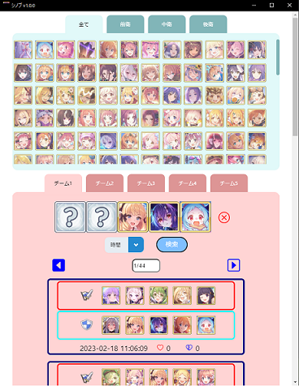

# シノブ

## 概要

プリンセスコネクトのバトル/プリンセスアリーナの防衛突破編成の検索ツール。

## 操作方法

相手の防衛編成のキャラクターを選択して、検索すると防衛突破編成が表示される。



## アプリのインストール

シノブ Setup ~.exe を実行して、アプリをインストールする。

## アプリのアンインストール

アプリと機能からシノブ選択して、アンインストールをする。

# 開発方法

## バージョン

- Node.js v16.18.1
- React v18.2.0
- Electron v23.1.2
- Typescript v4.9.5

## インストール

`package-lock.json`からパッケージをインストールする。

```shell
npm ci
```

## プログラムの実行

ビルドしてから、プログラムを実行する。

```shell
npm run build
```

```shell
npm run dev
```

# exeファイルを作成

dist 配下に Windows のインストーラ（シノブ Setup~.exe）を作成する。

```shell
npm run electron:build:nis
```
